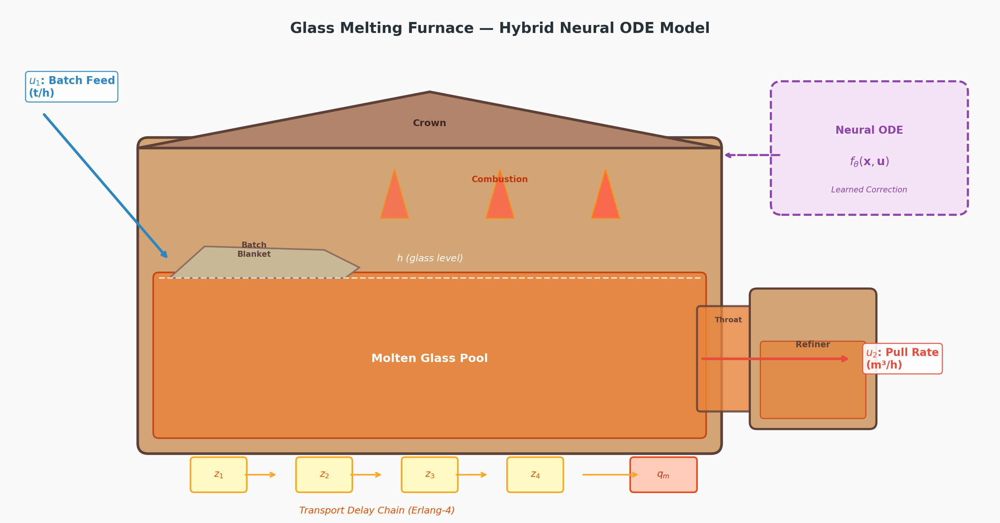

# Glass Furnace Modeling

A physics-informed machine learning framework for glass furnace modeling, with a focus on **glass melter level prediction** using hybrid Neural ODEs.

<p align="center">
  
</p>

## Overview

This repository contains the code and models for a research project on data-driven modeling of glass melting furnaces. The primary contribution is a **hybrid Neural ODE** approach that combines known physical laws with neural network corrections to accurately predict glass melter level dynamics.

### Key Features

- **Physics-informed Neural ODEs** — Hybrid models that embed known glass melter physics (transport delay chain, melting lag, level dynamics) with learned neural corrections
- **State Feedback Correction** — Luenberger observer-inspired correction mechanism that uses level measurements to prevent open-loop drift
- **Multiple Model Variants** — Three Neural ODE variants (v1, v2, v3) trained on different data regimes for robustness analysis
- **Publication-quality Visualization** — MATLAB-compatible figure styling for journal papers

## Repository Structure

```
glass-furnace-modeling/
├── README.md
├── LICENSE
├── pyproject.toml
├── requirements.txt
├── .gitignore
│
├── glass_melter_level/              # Main Python package
│   ├── __init__.py
│   ├── config.py                    # Physical parameters & constants
│   │
│   ├── data/                        # Data loading & preprocessing
│   │   ├── __init__.py
│   │   ├── loader.py                # Load LQI data, Excel files
│   │   ├── preprocessing.py         # Normalization, subsampling
│   │   └── scenario_generation.py   # Generate training scenarios
│   │
│   ├── models/                      # Model definitions
│   │   ├── __init__.py
│   │   ├── physics.py               # First-principles ODE model
│   │   └── neural_ode.py            # Hybrid Neural ODE model
│   │
│   ├── training/                    # Training pipelines
│   │   ├── __init__.py
│   │   ├── trainer.py               # Training loop with AMP + early stopping
│   │   └── trajectory.py            # Trajectory preparation utilities
│   │
│   ├── evaluation/                  # Evaluation & metrics
│   │   ├── __init__.py
│   │   └── metrics.py               # RMSE, MAE, R² computation
│   │
│   └── visualization/               # Plotting utilities
│       ├── __init__.py
│       ├── style.py                 # Publication-quality MATLAB styling
│       └── plots.py                 # Figure generation functions
│
├── scripts/                         # Executable scripts
│   ├── train_v1.py                  # Train Neural ODE v1 (LQI-range sim data)
│   ├── train_v2.py                  # Train Neural ODE v2 (extended-range sim data)
│   ├── train_v3.py                  # Train Neural ODE v3 (LQI data direct)
│   └── evaluate.py                  # Evaluate & compare all models
│
├── notebooks/                       # Jupyter notebooks
│   └── glass_melter_level_modeling.ipynb   # End-to-end demo notebook
│
├── trained_models/                  # Saved model checkpoints
│   └── .gitkeep
│
└── docs/                            # Documentation & figures
    └── figures/
        └── .gitkeep
```

## Glass Melter Physics

The glass melting furnace is modeled as a 7-state ODE system:

$$\mathbf{x} = [h, v, q_m, z_1, z_2, z_3, z_4]^T$$

| State | Description | Unit |
|-------|-------------|------|
| $h$ | Glass level | m |
| $v$ | Level rate of change | m/h |
| $q_m$ | Molten glass inflow rate | m³/h |
| $z_1 \ldots z_4$ | Transport delay chain states | t/h |

### Governing Equations

**Transport delay chain** (Erlang-4):
$$\dot{z}_i = \frac{N}{\theta}(z_{i-1} - z_i), \quad z_0 = u_1$$

**Melting lag**:
$$\dot{q}_m = \frac{-q_m + k_c z_4 (1 + k_w(w - w_0))}{\tau_m}$$

**Level dynamics**:
$$\dot{h} = v, \qquad \dot{v} = \frac{(q_m - q_p)/A - v}{\tau_\ell}$$

### Hybrid Neural ODE

The Neural ODE augments the physics with a learned correction:

$$\frac{d\mathbf{x}}{dt} = f_{\text{physics}}(\mathbf{x}, \mathbf{u}) + 0.1 \cdot f_\theta(\mathbf{x}, \mathbf{u})$$

where $f_\theta$ is a 3-layer neural network with 64 hidden units and Tanh activations.

## Installation

```bash
# Clone the repository
git clone https://github.com/jamesng1992/glass-furnace-modeling.git
cd glass-furnace-modeling

# Create a virtual environment (recommended)
python -m venv .venv
source .venv/bin/activate  # Linux/Mac
# .venv\Scripts\activate   # Windows

# Install dependencies
pip install -r requirements.txt

# Or install as editable package
pip install -e .
```

### Requirements

- Python ≥ 3.9
- PyTorch ≥ 2.0 (with CUDA support recommended)
- NumPy, SciPy, Pandas, Matplotlib, scikit-learn, openpyxl

## Quick Start

### 1. Train a model

```python
from glass_melter_level.models.neural_ode import NeuralODE_GlassMelter
from glass_melter_level.training.trainer import NeuralODETrainer
from glass_melter_level.data.loader import load_lqi_data

# Load data
df_true, df_est = load_lqi_data("path/to/glass_melter_LQI_outputs 1.xlsx")

# Create model
model = NeuralODE_GlassMelter(hidden_dim=64, n_layers=3, use_physics=True)

# Train
trainer = NeuralODETrainer(model, device="cuda")
trainer.train(train_trajectories, val_trajectories, n_epochs=200)
```

### 2. Run inference with state feedback correction

```python
from glass_melter_level.models.neural_ode import integrate_neural_ode_with_correction

# Predict with observer-like correction
x_pred = integrate_neural_ode_with_correction(
    model, x0, u_trajectory, t_trajectory,
    h_measured=h_measured,
    correction_gain=0.3
)
```

### 3. Use the script interface

```bash
# Train v1 model
python scripts/train_v1.py --data-path data/glass_melter_LQI_outputs\ 1.xlsx --epochs 200

# Evaluate all models
python scripts/evaluate.py --models-dir trained_models/ --data-path data/
```

## Model Variants

| Model | Training Data | Input Range | Description |
|-------|--------------|-------------|-------------|
| **v1** | Simulated (LQI-range) | u₁∈[0, 22.2], u₂∈[4.25, 6.75] | Trained within LQI operating range |
| **v2** | Simulated (extended) | u₁∈[0, 30], u₂∈[3.0, 8.0] | Broader operating envelope |
| **v3** | LQI data (60/20/20) | Actual controller data | Direct learning from closed-loop data |

## Citation

If you use this code in your research, please cite:

```bibtex
@article{nguyen2026glass,
  title={Physics-Informed Neural Ordinary Differential Equations with Observer-Based State Correction for Modeling and Predictive Control of Glass Melters},
  author={Nguyen, Xuan Dung James and Ibrahim, Toheeb Babatunde and Abouheaf, Mohammed and Peeno, Josh},
  journal={Journal of Process Control},
  year={2026}
}
```

## License

This project is licensed under the MIT License — see the [LICENSE](LICENSE) file for details.
